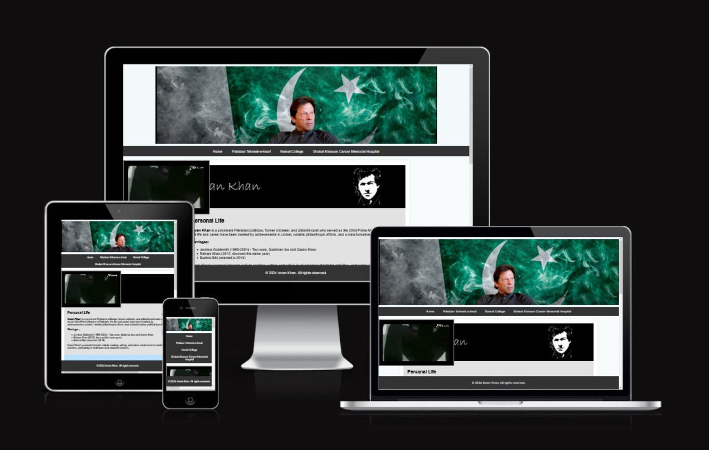
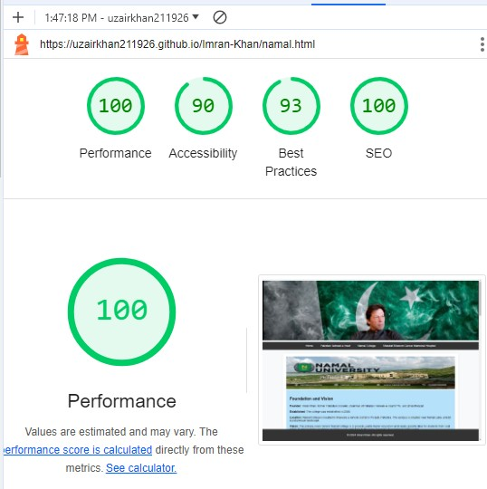

# Imran Khan

[View The Live Project Here](https://uzairkhan211926.github.io/Imran-Khan/)

A website about Imran Khan was driven by various motivations:

#####   1.   Educational Resource: 
-   I aim to provide comprehensive information and insights about 
    Imran Khan's life, career, and political impact, serving as a valuable resource for those 
    interested in his legacy.

#####   2.   Political Engagement:
-   I want to foster political discussion and engagement by 
    highlighting Imran Khan's policies, achievements, and contributions to Pakistan's socio-
    political landscape.

#####   3.   Fan Base Connection:
-   As a supporter, you wish to connect with like-minded individuals 
    and build a community that shares admiration for Imran Khan's leadership and vision.

#####   4.   Historical Documentation:
-   The website serves to document and preserve significant events 
    and milestones from Imran Khan's life and career, offering an archive for future reference.

#####   5.   Public Awareness:
-   I aim to raise awareness and educate the public on Imran Khan's 
    initiatives and the broader implications of his work, promoting a better understanding of 
    his role in national and international contexts.

##  Features:

### UI/UX:

####    1. Colour Scheme
-   This website has a contant color themes running through all the links. e.g., in
    the maine content: lightblue and silver. Ref block is grey, background is white throughout.
-   Font for body is Arial with fall back on sans-serif.

####    2. Typography

#####   1. Readability and Accessibility:
-   Arial is a widely recognized and legible font. It ensures that the content on the website
    is easy to read for most users, including those with visual impairments or using different
    devices.

#####   2.  Consistency and Universality:
-   Arial is a default font available on most operating systems and browsers. This ensures
    consistent rendering across different platforms, minimizing the risk of font rendering
    issues that might arise with less universally supported fonts.

#####   3.   Professional and Modern Appearance:
-   Arial is a sans-serif font known for its clean and modern appearance. It conveys a professional
    look suitable for a website dedicated to a public figure like Imran Khan.
    
#####   4.   Fallback for Compatibility:
-   Using "sans-serif" as a fallback ensures that if Arial is not available on a user's system, the
    browser will default to another sans-serif font that is available. This maintains the overall
    design integrity and readability of the website.

#####   5.   Load Time Considerations:
-   Arial is a commonly used font and may already be cached in users' browsers, potentially reducing
    load times compared to less common or custom fonts.

In summary, choosing Arial with a fallback on sans-serif fonts strikes a balance between 
readability, accessibility, compatibility, and aesthetic appeal, making it a sensible choice 
for a website about Imran Khan or any similar public figure.

### Existing Features:

####    1. Navigation Bar 
-   Along with the name of the website, the navigation bar includes the links to all the pages
    of the website i.e., Home, PTI, SKCMH & Namal College.
-   Through the navigation bar, the user can easily move around and take full advantage of all
    the features provided by the website. For user feasibility, I also fixed the nav bar so users
    can switch between the links without the need to scroll up to the top everytime.

 

 

####    2. The Landing Page
The landing page image shows a banner with Imran Khan's photo and a flag of Pakistan behind it. 
This is also a corelates to Imran and his passion for the nation. Home page also contains a
black 'n' white image of Imran Khan with his name for the users who do not know Imran Khan or his
name.

 

 

####    3. Information Section

#####   1.  Main content on Home page:
Here are some key points that a visitor would likely gather:

-   Personal Life.
-   Early Life and Education.
-   Cricketing Career.
-   Philanthropy.
-   Political Career.

 

These points provide a comprehensive overview of Imran Khan's life, spanning from his early days
to his achievements in cricket, philanthropy, and politics. They highlight his contributions and
impact in various fields throughout his career.

 

The home page does not contain a map due to privacy.

 

#####   2.  Main content on PTI page:
At first you will notice a PTI banner within the main content taken from it's original homepage.

On PTI page, it presents a comprehensive overview of PTI, covering its founding principles, key
milestones, leadership, policies, and challenges. It highlights PTI's vision for a corruption-free
Pakistan, its contributions to the political landscape, and its ongoing efforts to address economic
and social issues. The content also emphasizes PTI's focus on youth engagement and international relations,
portraying the party as a significant force in Pakistan's political arena.

It also contains a map of head office address. A similar map is also added for Namal College and Shaukat
Khanum Cancer Memorial Hospital.

 

 

#####   3.  Main content on Namal page:
The website presents a comprehensive overview of Namal College, highlighting its foundation, vision, mission,
and significant achievements. It emphasizes the college's commitment to providing quality education,
fostering research and innovation, and contributing to socio-economic development. The information underscores
Namal College’s role in empowering youth and making higher education accessible to students from diverse
backgrounds, particularly those from underprivileged areas. The content reflects the college's ongoing efforts
to expand its academic programs and enhance its infrastructure to continue serving as a beacon of hope and
progress in Pakistan's educational sector.

 

 
        
#####   4.  Main content on SKCMH page:
The website offers a comprehensive overview of Shaukat Khanum Memorial Cancer Hospital and Research Centre,
detailing its foundation, mission, and significant milestones. It highlights the hospital's extensive
infrastructure and services, emphasizing its role in providing high-quality, affordable cancer care. The
content underscores the hospital’s commitment to research, community outreach, and continuous expansion to
meet the growing healthcare needs in Pakistan. It also acknowledges the challenges the hospital faces and
outlines its future plans for further development and impact. The information reflects SKMCH&RC’s status as
a leading healthcare institution dedicated to improving cancer care and accessibility for all, particularly
those from underserved communities.

 

 

####    4.  Map Section
I have also added 3 maps to pin point the location of institutees founded by Imran Khan.
-   Head Secetrait of PTI
-   Namal College
-   Shaukat Khanum Cancer Memorial Hospital

 

 

####    5. Footer Section
-   It is dispalyed on all the pages of the website.

### Languages Used

-   [HTML5](https://en.wikipedia.org/wiki/HTML5)
-   [CSS3](https://en.wikipedia.org/wiki/Cascading_Style_Sheets)

### Frameworks, Libraries & Programs Used

-   [Git](https://git-scm.com/)
    - Git was used for version control by utilizing the Gitpod terminal to commit to Git and Push to GitHub.
-   [GitHub:](https://github.com/)
    - GitHub is used to store the project's code after being pushed from Git.
-   [Balsamiq:](https://balsamiq.com/)
    - Balsamiq was used to create the wireframes during the design process.

## Testing
The website has been thoroughly tested across a variety of devices and screen sizes, including a 21.5-inch monitor, a 15-inch laptop screen, an iPad, and several Android devices. It performs smoothly and generates accurate results on all these devices without any issues. On a computer, the hover effect on the information cards functions as expected, the links navigate to the correct pages, and the submit button on the form page redirects to the form-dump page, where the appropriate submission message is displayed. Additionally, the social media links in the footer successfully open their respective pages in a new tab.

To ensure the absence of syntax errors, the website was validated using the W3C Markup Validator and the W3C CSS Validator Services for every page of the project.

-   [W3C Markup Validator](https://validator.w3.org/#validate_by_input)
-   [Results](https://prnt.sc/PT_6zc72Jp2k)
-   [W3C CSS Validator](https://jigsaw.w3.org/css-validator/#validate_by_input)
-   [Results](https://prnt.sc/EPyW3F2hBths)

The website was also tested through Lighthouse on Chrome for its Accessibility Score. 

## Bugs

Some bugs I came accross during web designing. I added a video on all the different links. The issue
with videos, they were overlapping the main content. The issue could be fixed with further investigation.
However, due to lack of time available, I decided to remove the videos from the final draft.

below you can see the code

HTML Code:

    <section class="video.left">
      <video src="./assets/videos/imran.mp4" title="Imran Khan Video" width="350px" controls> </video>
    </section>

    CSS:

    .video{
    margin: 20px auto;
    padding: 20px;
    position: fixed;
    background-color: black;
    max-width: auto;
    border-style:groove;
}

## Deployment
The project was deployed to GitHub Pages using the following steps...

1. Log in to GitHub and locate the [GitHub Repository](https://github.com/UzairKhan211926/Imran-Khan)
2. At the top of the Repository (not the top of the page), locate the "Settings" Button on the menu.
3. On the Settings page, locate the "Pages" link on the left side, under the "Code and Automation" category. 
4. Under "Source", click the dropdown called "None" and select "Master Branch" or "Main".
5. The page will automatically refresh.
6. Scroll back down through the page to locate the now published site
[link](https://uzairkhan211926.github.io/Imran-Khan/) in the "GitHub Pages" section.

## Credits

### Media & Content
-   All the images were download from google.
-   All the text within main body was generated using ChatGPT.

## Acknowledgements

- My mentor for continuous help and valuable feedback.
- My colleague who was also a student of Code Institute 2 years ago.