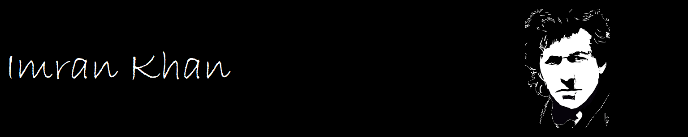

# Imran Khan

[View The Live Project Here](https://uzairkhan211926.github.io/Imran-Khan/)

A website about Imran Khan was driven by various motivations:

#####   Educational Resource: 
I aim to provide comprehensive information and insights about 
Imran Khan's life, career, and political impact, serving as a valuable resource for those 
interested in his legacy.

#####   Political Engagement:
I want to foster political discussion and engagement by 
highlighting Imran Khan's policies, achievements, and contributions to Pakistan's socio-
political landscape.

#####   Fan Base Connection:
As a supporter, you wish to connect with like-minded individuals 
and build a community that shares admiration for Imran Khan's leadership and vision.

#####   Historical Documentation:
The website serves to document and preserve significant events 
and milestones from Imran Khan's life and career, offering an archive for future reference.

#####   Public Awareness:
I aim to raise awareness and educate the public on Imran Khan's 
initiatives and the broader implications of his work, promoting a better understanding of 
his role in national and international contexts.


##  Features:

### UI/UX:

#### 1. Colour Scheme
-   This website has a contant color themes running through all the links. e.g., in
the maine content: lightblue and silver. Ref block is grey, background is white throughout.
-   Font for body is Arial with fall back on sans-serif.

#### 2. Typography

#####   Readability and Accessibility:
-   Arial is a widely recognized and legible font. It ensures that the content on the website
is easy to read for most users, including those with visual impairments or using different
devices.

#####   Consistency and Universality:
-   Arial is a default font available on most operating systems and browsers. This ensures
consistent rendering across different platforms, minimizing the risk of font rendering
issues that might arise with less universally supported fonts.

#####   Professional and Modern Appearance:
-   Arial is a sans-serif font known for its clean and modern appearance. It conveys a professional
look suitable for a website dedicated to a public figure like Imran Khan.
    
#####   Fallback for Compatibility:
-   Using "sans-serif" as a fallback ensures that if Arial is not available on a user's system, the
browser will default to another sans-serif font that is available. This maintains the overall
design integrity and readability of the website.

#####   Load Time Considerations:
-   Arial is a commonly used font and may already be cached in users' browsers, potentially reducing
load times compared to less common or custom fonts.

In summary, choosing Arial with a fallback on sans-serif fonts strikes a balance between 
readability, accessibility, compatibility, and aesthetic appeal, making it a sensible choice 
for a website about Imran Khan or any similar public figure.

### Existing Features:

#### 1. Navigation Bar 
-   Along with the name of the website, the navigation bar includes the links to all the pages
of the website i.e., Home, PTI, SKCMH & Namal College.
-   Through the navigation bar, the user can easily move around and take full advantage of all
the features provided by the website. For user feasibility, I also fixed the nav bar so users
can switch between the links without the need to scroll up to the top everytime.

<br>

<br>

#### 2. The Landing Page
The landing page image shows a banner with Imran Khan's photo and a flag of Pakistan behind it. 
This is also a corelates to Imran and his passion for the nation. Home page also contains a
black 'n' white image of Imran Khan with his name for the users who do not know Imran Khan or his
name.

<br>


<br>

#### 4. Information Section

#####   Main content on Home page:
    Here are some key points that a visitor would likely gather:

    -Personal Life.
    -Early Life and Education.
    -Cricketing Career.
    -Philanthropy.
    -Political Career.
<br>
    These points provide a comprehensive overview of Imran Khan's life, spanning from his early days
    to his achievements in cricket, philanthropy, and politics. They highlight his contributions and
    impact in various fields throughout his career.
<br>
The home page does not contain a map due to privacy.
<br>

#####   Main content on PTI page:
    At first you will notice a PTI banner within the main content taken from it's original homepage.
<br>
    On PTI page, it presents a comprehensive overview of PTI, covering its founding principles, key
    milestones, leadership, policies, and challenges. It highlights PTI's vision for a corruption-free
    Pakistan, its contributions to the political landscape, and its ongoing efforts to address economic
    and social issues. The content also emphasizes PTI's focus on youth engagement and international relations,
    portraying the party as a significant force in Pakistan's political arena.

    It also contains a map of head office address. A similar map is also added for Namal College and Shaukat
    Khanum Cancer Memorial Hospital.
<br>

<br>

#####   Main content on Namal page:
    The website presents a comprehensive overview of Namal College, highlighting its foundation, vision, mission,
    and significant achievements. It emphasizes the college's commitment to providing quality education,
    fostering research and innovation, and contributing to socio-economic development. The information underscores
    Namal College’s role in empowering youth and making higher education accessible to students from diverse
    backgrounds, particularly those from underprivileged areas. The content reflects the college's ongoing efforts
    to expand its academic programs and enhance its infrastructure to continue serving as a beacon of hope and
    progress in Pakistan's educational sector.
<br>

<br>
        
#####   Main content on SKCMH page:
    The website offers a comprehensive overview of Shaukat Khanum Memorial Cancer Hospital and Research Centre, detailing its foundation, mission, and significant milestones. It highlights the hospital's extensive infrastructure and services, emphasizing its role in providing high-quality, affordable cancer care. The content underscores the hospital’s commitment to research, community outreach, and continuous expansion to meet the growing healthcare needs in Pakistan. It also acknowledges the challenges the hospital faces and outlines its future plans for further development and impact. The information reflects SKMCH&RC’s status as a leading healthcare institution dedicated to improving cancer care and accessibility for all, particularly those from underserved communities.
<br>

<br>

#### 5. Map Section
        I have also added 3 maps to pin point the location of institutees founded by Imran Khan.
        -Head Secetrait of PTI
        -Namal College
        -Shaukat Khanum Cancer Memorial Hospital
<br>

<br>

#### 6. Footer Section
        - The Footer Section holds and displays the links to the social media profiles dedicated to the Red Fort and opens in a new tab.
        - This section is in contrast to the background of the webpage and displays the icons of the respective social media links, which a user can easily access.
        - It is dispalyed on all the pages of the website.
        <br>
        
        <br>

## Technologies Used

### Languages Used

-   [HTML5](https://en.wikipedia.org/wiki/HTML5)
-   [CSS3](https://en.wikipedia.org/wiki/Cascading_Style_Sheets)

### Frameworks, Libraries & Programs Used

1. [Google Fonts:](https://fonts.google.com/)
    - Google fonts were used to import the 'Quintessential', 'Roboto Condensed' and 'Zen Kaku Gothic Antique' font into the style.css file which is used on all pages throughout the project.
2. [Font Awesome:](https://fontawesome.com/)
    - Font Awesome was used on all pages throughout the website to add icons for aesthetic and UX purposes.
3. [Git](https://git-scm.com/)
    - Git was used for version control by utilizing the Gitpod terminal to commit to Git and Push to GitHub.
4. [GitHub:](https://github.com/)
    - GitHub is used to store the project's code after being pushed from Git.
5. [Balsamiq:](https://balsamiq.com/)
    - Balsamiq was used to create the wireframes during the design process.

## Testing
The website has been tested on different devices and screen sizes, eg. a 21.5inch monitor, 15inch laptop screen, iPad and Android devices. The website runs smoothly and generates appropriate results without any issues. The hover effect on information cards work properly on the computer, the links take you to appropriate pages and the submit button on the form page takes you to the form-dump page with the proper message for submission displayed. The social media links in the footer open the associated pages in new tab, as intended.

The W3C Markup Validator and W3C CSS Validator Services were used to validate every page of the project to ensure there were no syntax errors in the project.

-   [W3C Markup Validator](https://validator.w3.org/#validate_by_input) - [Results](https://validator.w3.org/nu/?doc=https%3A%2F%2Ffarrukh-ahm.github.io%2FPortfolio-Project-1%2F)
-   [W3C CSS Validator](https://jigsaw.w3.org/css-validator/#validate_by_input) - [Results](https://jigsaw.w3.org/css-validator/validator?uri=https%3A%2F%2Ffarrukh-ahm.github.io%2FPortfolio-Project-1%2Findex.html&profile=css3svg&usermedium=all&warning=1&vextwarning=&lang=en)

The website was also tested through Lighthouse on Chrome for its Accessibility Score.<br>


## Known Bugs
On some iPhone devices, the buttons on the Form page do not display properly. This is mostly due to the higher pixel density on iPhones. Attempted to resolve this by using more media queries with different widths and webkit device pixel ratios, but it didn't work. It's difficult to properly fix this issue as it displays properly on Chrome and Firefox's dev tools with simulated mobile screens, including iPhone screens. However, upon deploying and opening the website on the actual iPhone device itself, it shows issues. This will need further investigation. No other known bugs were found after numerous testings.

## Deployment
The project was deployed to GitHub Pages using the following steps...

1. Log in to GitHub and locate the [GitHub Repository](https://github.com/farrukh-ahm/Portfolio-Project-1.git)
2. At the top of the Repository (not the top of the page), locate the "Settings" Button on the menu.
3. On the Settings page, locate the "Pages" link on the left side, under the "Code and Automation" category. 
4. Under "Source", click the dropdown called "None" and select "Master Branch" or "Main".
5. The page will automatically refresh.
6. Scroll back down through the page to locate the now published site [link](https://farrukh-ahm.github.io/Portfolio-Project-1/) in the "GitHub Pages" section.

## Credits

* ### Content

    - The content for the History, Architect and Present Day was taken from Red Fort's [Wikipedia](https://en.wikipedia.org/wiki/Red_Fort) and [Britannica](https://www.britannica.com/topic/Red-Fort) entries.
    - The content for the [Qutab Minar](https://delhitourism.gov.in/delhitourism/tourist_place/qutab_minar.jsp) and [Jama Masjid](https://delhitourism.gov.in/delhitourism/tourist_place/jama_masjid.jsp) were taken from the Delhi Tourism website.
    - The content for the India Gate was taken from the [IncredibleIndia](https://www.incredibleindia.org/content/incredible-india-v2/en/destinations/delhi/india-gate.html) website.
    - The content for the Humayun's Tomb was taken from the [WHC-UNESCO](https://whc.unesco.org/en/list/232/) website.

* ### Media

    - All the images used on the website are free-to-use provided by [Unsplash](https://unsplash.com/).
    - The images are hosted by the following photographers as mentioned on the website:
        1. Main page banner: Swapnil Deshpandey
        2. Other-Places banner: Godwin Angeline Benjo
        3. Architect: Mohd. Sharif
        4. Present Day: Tarun Anand Giri
        5. Qutab Minar: Rituraj Pankaj
        6. India Gate: Shalender Kumar
        7. Jama Masjid: Mayur Sable
        8. Humayun’s Tomb: Unknown Traveller
        9. Book A Tour page background: Jan Canty
    - Shah Jahan image (History Section): https://www.pngwing.com/en/free-png-nnjyy 

* ### Code

The following code block used from [Stack Overflow](https://stackoverflow.com), answer given to following question on the given link:<br>
[How to make body background image transparent in css? (sirdn4)](https://stackoverflow.com/questions/42312909/how-to-make-body-background-image-transparent-in-css/42313865)

```
body::after {
  background: url(“</address>”);
  content: "";
  opacity: 0.9;
  position: absolute;
  top: 0;
  bottom: 0;
  right: 0;
  left: 0;
  z-index: -1;   
}
```

## Acknowledgements

- My mentor for continuous help and valuable feedback.
- Tutor support at Code Institute for their support.